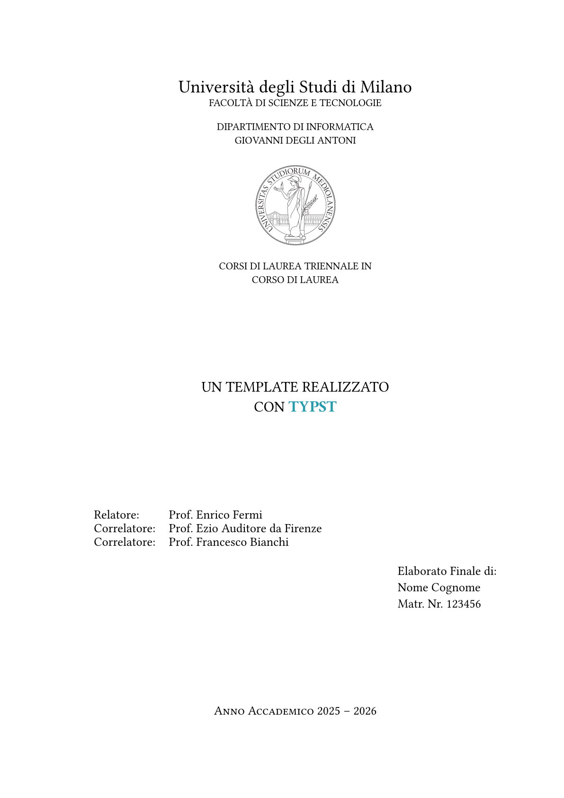

# unimi-thesis 🎓

This template is the result of the conversion from the [original LaTeX template](https://www.overleaf.com/project/641879675262cde2a670826b).

## Preview ✨

<p align="center">
  
</p>

> [!TIP]
> See `docs/instructions.pdf` for more informations about the template (in Italian).

## Usage 🚀

Compile with con:

```shell
typst c main.typ --pdf-standard a-3b
```

The following excerpt is the canonical example of how the template can be structured:

```typ
#import "@preview/unimi-thesis:1.0.0": *

#show: project.with(language: "en")

#show: frontmatter.with()

// dedication

#show: acknowledgements.with()

// acknowledgements

#toc

#show: mainmatter.with()

// main section of the thesis

#show: appendix.with()

// appendix

#show: backmatter.with()

// bibliography

// associated laboratory
#closingpage("associated_lab")

```

## Issues 

- [ ] The first line after the Chapter should not be indented
